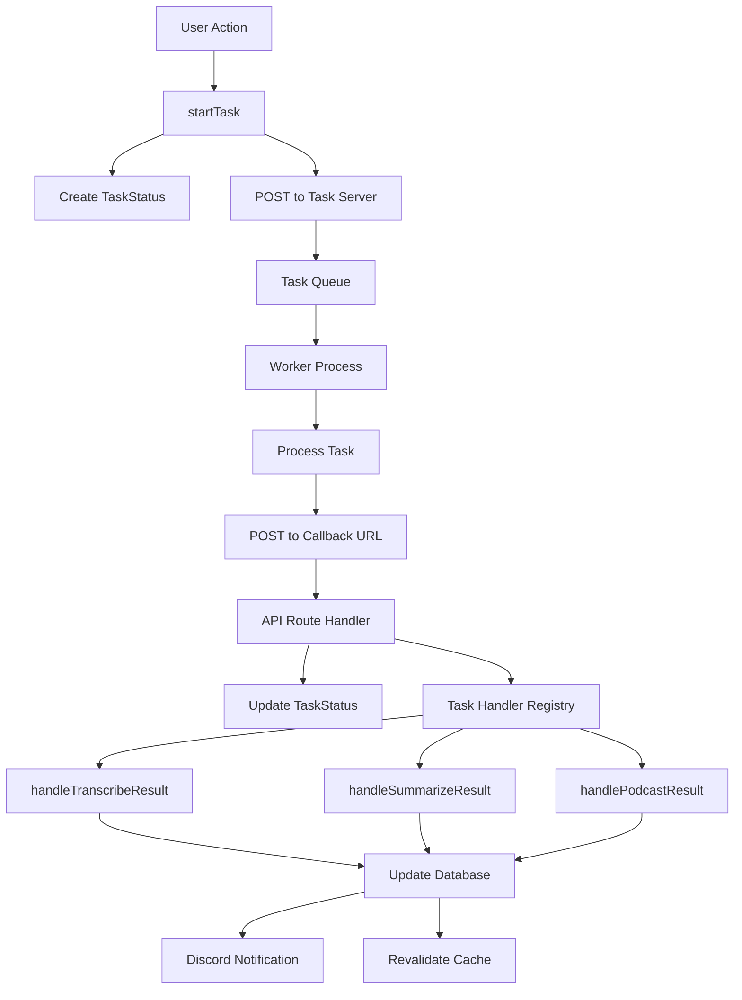

## High-level architecture

OpenCouncil is built as a modern web application with a decoupled task processing architecture. The system consists of three main components:

<CardGroup cols={3}>
  <Card title="Next.js application" icon="browser">
    User-facing web application with Server Components and API routes
  </Card>
  <Card title="Task server" icon="server">
    Background processing server for AI and media tasks
  </Card>
  <Card title="PostgreSQL database" icon="database">
    Data persistence with PostGIS for geospatial features
  </Card>
</CardGroup>

## Technology stack

### Frontend layer

<CodeGroup>
```typescript Framework
// Next.js 14 with App Router and TypeScript
// Server Components by default, Client Components when needed
import { Suspense } from 'react'
import MeetingList from '@/components/meetings/MeetingList'

export default function MeetingsPage() {
  return (
    <Suspense fallback={<LoadingSkeleton />}>
      <MeetingList />
    </Suspense>
  )
}
```

```typescript UI Components
// Radix UI primitives with Tailwind CSS
import { Button } from '@/components/ui/button'
import { Dialog } from '@/components/ui/dialog'

// class-variance-authority for variants
import { cva } from 'class-variance-authority'
```
</CodeGroup>

**Key technologies:**
- **Next.js 14**: App Router with Server Components and React Server Actions
- **TypeScript**: Strict mode enabled for type safety
- **Tailwind CSS**: Utility-first styling with custom design system
- **Radix UI**: Accessible component primitives
- **Framer Motion**: Animation library
- **React Hook Form + Zod**: Form handling and validation

### Backend layer

<CodeGroup>
```typescript Database Access
// Prisma ORM with type-safe queries
import prisma from '@/lib/db/prisma'

export async function getCouncilMeetings(cityId: string) {
  return await prisma.councilMeeting.findMany({
    where: { cityId },
    include: {
      administrativeBody: true,
      subjects: true,
    },
    orderBy: { date: 'desc' },
  })
}
```

```typescript Authentication
// Auth.js (NextAuth v5) with Resend email provider
import { auth } from '@/auth'

export async function isUserAuthorizedToEdit({
  cityId,
}: {
  cityId: string
}): Promise<boolean> {
  const session = await auth()
  if (!session) return false
  
  // Check user permissions
  return checkCityPermissions(session.user.id, cityId)
}
```
</CodeGroup>

**Key technologies:**
- **Prisma ORM**: Type-safe database access with migrations
- **Auth.js**: Session-based authentication with email magic links
- **PostgreSQL 14+**: Primary database with PostGIS extension
- **Elasticsearch**: Full-text search and content discovery

### AI and media processing

<CodeGroup>
```typescript AI Integration
// Anthropic Claude for summaries and chat
import Anthropic from '@anthropic-ai/sdk'

const client = new Anthropic({
  apiKey: env.ANTHROPIC_API_KEY,
})

export async function generateSummary(text: string) {
  const response = await client.messages.create({
    model: 'claude-3-5-sonnet-20241022',
    max_tokens: 1024,
    messages: [{ role: 'user', content: text }],
  })
  return response.content
}
```

```typescript Task Processing
// Async task workflow with callback pattern
import { startTask } from '@/lib/tasks/tasks'

export async function transcribeMeeting(
  meetingId: string,
  cityId: string
) {
  await startTask(
    'transcribe',
    {
      audioUrl: meeting.audioUrl,
      language: 'el',
    },
    meetingId,
    cityId
  )
}
```
</CodeGroup>

**Key technologies:**
- **Anthropic Claude**: AI summaries and chat assistant
- **Google Cloud Speech-to-Text**: Audio transcription
- **DigitalOcean Spaces**: S3-compatible object storage for media
- **Custom task queue**: Background job processing with callbacks

## Application architecture

### Directory structure

```
opencouncil/
├── src/
│   ├── app/                    # Next.js App Router
│   │   ├── [locale]/          # Locale-parameterized routes
│   │   │   ├── page.tsx       # Home page
│   │   │   ├── cities/        # City pages
│   │   │   ├── meetings/      # Meeting pages
│   │   │   └── search/        # Search interface
│   │   └── api/               # API routes
│   │       ├── cities/        # City CRUD operations
│   │       ├── meetings/      # Meeting operations
│   │       ├── search/        # Search endpoints
│   │       ├── chat/          # AI chat
│   │       └── cron/          # Scheduled tasks
│   ├── components/            # React components
│   │   ├── ui/               # Base UI components (Radix)
│   │   ├── meetings/         # Meeting-specific components
│   │   ├── chat/             # Chat interface
│   │   ├── map/              # Mapbox integration
│   │   └── search/           # Search components
│   ├── lib/                   # Business logic & services
│   │   ├── db/               # Data access layer
│   │   │   ├── cities.ts     # City queries
│   │   │   ├── meetings.ts   # Meeting queries
│   │   │   └── types/        # Shared Prisma types
│   │   ├── tasks/            # Task management
│   │   │   ├── tasks.ts      # Core task logic
│   │   │   ├── transcribe.ts # Transcription handler
│   │   │   ├── summarize.ts  # Summary handler
│   │   │   └── registry.ts   # Task handler registry
│   │   ├── search/           # Elasticsearch integration
│   │   ├── notifications/    # Multi-channel notifications
│   │   ├── ai.ts             # AI integration
│   │   ├── s3.ts             # Object storage
│   │   └── auth.ts           # Authentication helpers
│   ├── contexts/             # React Context providers
│   ├── hooks/                # Custom React hooks
│   └── types/                # TypeScript type definitions
├── prisma/
│   ├── schema.prisma         # Database schema
│   ├── migrations/           # Migration files
│   └── seed.ts               # Seed data script
├── public/                    # Static assets
└── tests/                     # Test suites
```

### Data access patterns

OpenCouncil follows strict data access patterns for maintainability:

<Note>
  **All database queries use centralized functions in `src/lib/db/`**. This prevents scattered query logic and ensures consistent data access patterns.
</Note>

<CodeGroup>
```typescript src/lib/db/cities.ts
// Centralized city queries
export async function getCities() {
  return await prisma.city.findMany({
    where: { status: 'listed' },
    orderBy: { name: 'asc' },
  })
}

export async function getCityById(id: string) {
  return await prisma.city.findUnique({
    where: { id },
    include: {
      administrativeBodies: true,
      parties: true,
    },
  })
}
```

```typescript src/lib/db/meetings.ts
// Centralized meeting queries
export async function getCouncilMeeting(
  cityId: string,
  meetingId: string
) {
  return await prisma.councilMeeting.findUnique({
    where: {
      cityId_id: { cityId, id: meetingId },
    },
    include: {
      subjects: true,
      speakerSegments: {
        include: {
          person: true,
          utterances: {
            include: { words: true },
          },
        },
      },
    },
  })
}
```
</CodeGroup>

**Type storage:**
- Store shared Prisma types in `src/lib/db/types/{entity}.ts`
- Re-export from `src/lib/db/types/index.ts`
- Import from `@/lib/db/types` to prevent circular dependencies

## Task workflow architecture

The task system is designed to offload long-running processes from the main application to a dedicated backend server.

### Task lifecycle

<Steps>
  <Step title="Initiation">
    User action or cron job triggers `startTask()` function:
    
    ```typescript
    await startTask(
      'transcribe',
      { audioUrl, language: 'el' },
      meetingId,
      cityId
    )
    ```
    
    - Creates `TaskStatus` record in database
    - Sends POST request to task server with `callbackUrl`
  </Step>
  
  <Step title="Execution">
    Backend task server processes the job:
    
    - Task added to custom in-memory queue
    - Worker process executes the task
    - Sends progress updates to callback URL
  </Step>
  
  <Step title="Completion">
    Task server sends final result:
    
    - Status: `success` or `error`
    - Result data or error message
    - Full response stored in `TaskStatus.responseBody`
  </Step>
  
  <Step title="Result handling">
    Next.js application processes the result:
    
    ```typescript
    // Task handler registry automatically routes to correct handler
    const handler = taskHandlers[taskType]
    await handler(taskId, result, options)
    ```
    
    - Updates database with task results
    - Triggers downstream tasks if needed
    - Sends Discord notifications to admins
  </Step>
</Steps>

### Task architecture diagram



### Task types

OpenCouncil supports multiple task types:

<AccordionGroup>
  <Accordion title="Transcribe">
    Converts audio/video to text with speaker recognition:
    
    - Uses Google Cloud Speech-to-Text or Whisper
    - Generates speaker segments and utterances
    - Creates word-level timestamps
    - Identifies speakers using voiceprints
    
    **Handler:** `src/lib/tasks/transcribe.ts`
  </Accordion>
  
  <Accordion title="Summarize">
    Generates AI summaries of speeches:
    
    - Analyzes speaker utterances
    - Extracts key topics and subjects
    - Creates structured summaries
    - Links to existing subjects or creates new ones
    
    **Handler:** `src/lib/tasks/summarize.ts`
  </Accordion>
  
  <Accordion title="Generate voiceprint">
    Creates speaker voice profiles:
    
    - Analyzes audio samples
    - Generates unique voiceprint
    - Enables automatic speaker identification
    
    **Handler:** `src/lib/tasks/generateVoiceprint.ts`
  </Accordion>
  
  <Accordion title="Generate podcast">
    Creates podcast-style audio content:
    
    - Extracts key segments from meetings
    - Generates host narration
    - Produces structured audio content
    
    **Handler:** `src/lib/tasks/generatePodcast.ts`
  </Accordion>
  
  <Accordion title="Poll decisions">
    Fetches decisions from Diavgeia:
    
    - Queries Greek government transparency portal
    - Links decisions to meeting subjects
    - Progressive backoff to avoid over-polling
    
    **Handler:** `src/lib/tasks/pollDecisions.ts`
  </Accordion>
</AccordionGroup>

### Task reprocessing

A key feature is the ability to reprocess task results without re-running the entire task:

```typescript
// Reprocess stored task result
await processTaskResponse('transcribe', taskId, { force: true })
```

**Force mode:** Some tasks (like transcribe) create data that can't be updated in place. The `force` flag triggers cleanup:

1. Delete existing `SpeakerSegment`, `Utterance`, and `Word` records
2. Recreate everything from stored `responseBody`

This prevents duplicates and ensures data consistency.

## Database architecture

### Schema overview

OpenCouncil uses PostgreSQL with the PostGIS extension for geospatial features.

<CodeGroup>
```prisma Core Models
model City {
  id                String   @id @default(cuid())
  name              String   // Greek name
  name_en           String   // English name
  timezone          String
  geometry          Unsupported("geometry")?
  status            CityStatus @default(pending)
  
  councilMeetings   CouncilMeeting[]
  parties           Party[]
  persons           Person[]
}

model CouncilMeeting {
  cityId            String
  id                String
  name              String
  name_en           String
  date              DateTime
  videoUrl          String?
  audioUrl          String?
  
  subjects          Subject[]
  speakerSegments   SpeakerSegment[]
  taskStatuses      TaskStatus[]
  
  @@id([cityId, id])
}
```

```prisma Transcription Models
model SpeakerSegment {
  id                String   @id @default(cuid())
  startTime         Float
  endTime           Float
  
  person            Person?
  speakerTag        SpeakerTag?
  utterances        Utterance[]
  councilMeeting    CouncilMeeting
}

model Utterance {
  id                String   @id @default(cuid())
  text              String
  startTime         Float
  endTime           Float
  
  words             Word[]
  speakerSegment    SpeakerSegment
  summary           String?
}

model Word {
  id                String   @id @default(cuid())
  word              String
  startTime         Float
  endTime           Float
  confidence        Float?
  
  utterance         Utterance
}
```
</CodeGroup>

### Composite keys

Many models use composite keys `(cityId, id)` for multi-tenant data isolation:

```prisma
model CouncilMeeting {
  cityId  String
  id      String
  // ... other fields
  
  @@id([cityId, id])
}
```

This pattern ensures meetings are scoped to their city and prevents ID collisions.

### Key relationships

<Accordion title="City → Meetings → Subjects">
  ```
  City
    └── CouncilMeeting (many)
          └── Subject (many)
                ├── Decision (one, optional)
                └── Mentions (many to Person/Party)
  ```
</Accordion>

<Accordion title="Meeting → Transcription">
  ```
  CouncilMeeting
    └── SpeakerSegment (many)
          ├── Person (one, optional)
          └── Utterance (many)
                ├── Words (many)
                └── Summary (text)
  ```
</Accordion>

<Accordion title="Task processing">
  ```
  CouncilMeeting
    └── TaskStatus (many)
          ├── Type (transcribe, summarize, etc.)
          ├── Status (pending, processing, succeeded, failed)
          ├── RequestBody (JSON)
          └── ResponseBody (JSON, stored for reprocessing)
  ```
</Accordion>

## Search architecture

OpenCouncil uses Elasticsearch for full-text search across transcripts.

### Search features

<CardGroup cols={2}>
  <Card title="Natural language queries" icon="message">
    Parse user queries and extract filters automatically
  </Card>
  <Card title="Filter extraction" icon="filter">
    Identify city, person, party, topic, date, and location filters
  </Card>
  <Card title="Multi-field search" icon="magnifying-glass">
    Search across utterances, summaries, and subjects
  </Card>
  <Card title="Retry logic" icon="rotate">
    Exponential backoff for reliability
  </Card>
</CardGroup>

### Search implementation

```typescript
// src/lib/search/index.ts
export async function search(
  request: SearchRequest
): Promise<SearchResponse> {
  // Extract filters from natural language query
  const filters = await extractFilters(request.query)
  
  // Build Elasticsearch query
  const query = buildSearchQuery({
    query: request.query,
    cityIds: filters.cityIds || request.cityIds,
    personIds: filters.personIds,
    dateRange: filters.dateRange,
  })
  
  // Execute with retry logic
  const results = await executeElasticsearchWithRetry(query)
  
  return results
}
```

## Notification system

Multi-channel notification delivery with user preferences:

<Steps>
  <Step title="Matching engine">
    Match notifications to user preferences:
    - Topics of interest
    - Specific people or parties
    - Geographic locations
    - Meeting types
  </Step>
  
  <Step title="Approval workflow">
    For cities with `NOTIFICATIONS_APPROVAL` mode:
    - Notifications enter pending queue
    - Admins review and approve
    - Batch sending on approval
  </Step>
  
  <Step title="Multi-channel delivery">
    Send via configured channels:
    - **Email**: Resend API
    - **WhatsApp**: Bird API
    - **SMS**: Bird API
  </Step>
  
  <Step title="Rate limiting">
    Prevent overwhelming users:
    - 500ms delays between sends
    - Batch processing
    - Per-user throttling
  </Step>
</Steps>

## Key integrations

<CardGroup cols={2}>
  <Card title="Anthropic Claude" icon="brain">
    AI summaries, chat assistant, and content generation
  </Card>
  <Card title="Elasticsearch" icon="magnifying-glass">
    Full-text search and content discovery
  </Card>
  <Card title="Resend" icon="envelope">
    Email authentication and notifications
  </Card>
  <Card title="Bird API" icon="message">
    WhatsApp and SMS notifications
  </Card>
  <Card title="DigitalOcean Spaces" icon="box">
    S3-compatible object storage for media
  </Card>
  <Card title="Google Calendar" icon="calendar">
    Event scheduling and synchronization
  </Card>
  <Card title="Discord" icon="discord">
    Real-time admin alerts for system events
  </Card>
  <Card title="Mapbox" icon="map">
    Interactive maps and geospatial features
  </Card>
</CardGroup>

## Deployment architecture

### Production setup

<CodeGroup>
```dockerfile Dockerfile
FROM node:18-alpine AS base

# Install dependencies
RUN apk add --no-cache libc6-compat
WORKDIR /app

# Copy dependencies
COPY package*.json ./
COPY prisma ./prisma/

# Install dependencies
RUN npm ci

# Build application
COPY . .
RUN npm run build

# Production image
FROM node:18-alpine AS runner
WORKDIR /app

ENV NODE_ENV production

COPY --from=base /app/.next/standalone ./
COPY --from=base /app/.next/static ./.next/static
COPY --from=base /app/public ./public

EXPOSE 3000

CMD ["node", "server.js"]
```

```yaml docker-compose.yml
services:
  app:
    build:
      context: .
      dockerfile: Dockerfile
    ports:
      - "3000:3000"
    environment:
      - DATABASE_URL=${DATABASE_URL}
      - NEXTAUTH_SECRET=${NEXTAUTH_SECRET}
    depends_on:
      - db

  db:
    image: postgis/postgis:16-3.5
    volumes:
      - pgdata:/var/lib/postgresql/data
    environment:
      - POSTGRES_DB=opencouncil
      - POSTGRES_USER=postgres
      - POSTGRES_PASSWORD=${DB_PASSWORD}

volumes:
  pgdata:
```
</CodeGroup>

### Scaling considerations

<Warning>
  When scaling horizontally, consider:
  - Database connection pooling (use Prisma Accelerate or PgBouncer)
  - Redis for session storage
  - CDN for static assets
  - Load balancer for multiple app instances
</Warning>

## Security architecture

### Authentication flow

<Steps>
  <Step title="User requests sign-in">
    User enters email on login page
  </Step>
  
  <Step title="Magic link sent">
    Auth.js generates secure token and sends via Resend
  </Step>
  
  <Step title="User clicks link">
    Token validated and session created
  </Step>
  
  <Step title="Session persisted">
    Encrypted session cookie stored in browser
  </Step>
</Steps>

### Authorization patterns

OpenCouncil uses centralized authorization helpers:

```typescript
// src/lib/auth.ts

// For conditional UI (returns boolean)
const editable = await isUserAuthorizedToEdit({ cityId })

// For API routes (throws if unauthorized)
await withUserAuthorizedToEdit({ cityId })
```

<Warning>
  **Both methods are async and must be awaited** to prevent auth bypass bugs.
</Warning>

## Performance optimizations

### Caching strategy

<CodeGroup>
```typescript React Cache
import { cache } from 'react'

// Cache function for request deduplication
export const getCityById = cache(async (id: string) => {
  return await prisma.city.findUnique({ where: { id } })
})
```

```typescript Next.js Cache
import { unstable_cache } from 'next/cache'

// Cache with revalidation
export const getCities = unstable_cache(
  async () => {
    return await prisma.city.findMany()
  },
  ['cities'],
  { revalidate: 3600 } // 1 hour
)
```
</CodeGroup>

### Database optimization

- **Indexes**: Strategic indexes on frequently queried fields
- **Connection pooling**: Prisma connection pool configuration
- **Query optimization**: Use `select` to fetch only needed fields
- **Pagination**: Cursor-based pagination for large datasets

## Monitoring and observability

### Discord integration

Admin alerts sent to Discord webhook:

```typescript
// Task completion alerts
await sendTaskAdminAlert({
  taskType: 'transcribe',
  status: 'succeeded',
  meetingName: 'City Council Meeting',
  duration: '2h 15m',
})

// Error alerts
await sendTaskAdminAlert({
  taskType: 'summarize',
  status: 'failed',
  error: 'API rate limit exceeded',
})
```

### Logging

- Structured logging for search analytics
- Task execution logging
- API request logging
- Error tracking with context

## Next steps

<CardGroup cols={2}>
  <Card title="Database schema" icon="database" href="/database-schema">
    Detailed database schema documentation
  </Card>
  <Card title="API reference" icon="code" href="/api-reference">
    Complete REST API documentation
  </Card>
  <Card title="Task system" icon="server" href="/tasks">
    Deep dive into task processing
  </Card>
  <Card title="Contributing" icon="code-pull-request" href="/contributing">
    Join the development workflow
  </Card>
</CardGroup>
