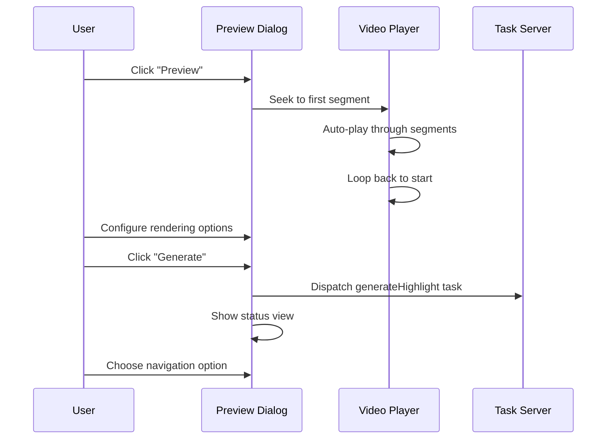

Meeting highlights allow you to select segments of a meeting's transcript and combine them into shareable video clips. The system supports multiple aspect ratios, automatic captions, speaker overlays, and social media optimizations for platforms like Instagram, TikTok, and YouTube Shorts.

## Key capabilities

<CardGroup cols={2}>
  <Card title="Visual editing" icon="scissors">
    Select utterances directly from the transcript timeline with click-and-drag or Shift+Click range selection.
  </Card>
  
  <Card title="Live preview" icon="play">
    Preview your highlight with automatic playback through selected segments before generating the final video.
  </Card>
  
  <Card title="Multiple formats" icon="mobile">
    Generate in 16:9 landscape for desktop or 9:16 portrait for social media platforms.
  </Card>
  
  <Card title="Smart rendering" icon="wand-magic-sparkles">
    Automatic captions, speaker overlays, and social media enhancements like blur margins and zoom.
  </Card>
</CardGroup>

## How highlights work

The highlight system uses a page-based architecture with editing mode on the transcript page:

<Steps>
  <Step title="Create highlight">
    Click the "Create Highlight" button in the header, right-click an utterance to start from that point, or use the "+ Add Highlight" button in the list. The system creates a highlight with an auto-generated name.
  </Step>
  
  <Step title="Edit content">
    Select utterances in transcript view. Click individual utterances to toggle them, or Shift+Click to select ranges. Changes are tracked with an "Unsaved Changes" badge.
  </Step>
  
  <Step title="Preview playback">
    Open the preview dialog to watch your highlight with automatic playback through segments. The video loops back to the beginning for continuous review.
  </Step>
  
  <Step title="Configure rendering">
    Choose aspect ratio (16:9 or 9:16), enable captions and speaker overlays, and configure social media enhancements in the preview dialog.
  </Step>
  
  <Step title="Generate video">
    Click "Generate" to dispatch a background task. The system auto-saves unsaved changes before generation. Track progress on the highlight detail page.
  </Step>
  
  <Step title="Share">
    Download the generated video or share the highlight page link. Videos support both landscape and portrait formats with responsive player.
  </Step>
</Steps>

## Creating highlights

There are three ways to create a highlight:

<Tabs>
  <Tab title="Header button (primary)">
    Click the "Create Highlight" button (⭐) in the page header:
    
    1. Creates highlight with name "Unnamed Highlight"
    2. Redirects to transcript page in editing mode
    3. No utterances pre-selected - start from scratch
    
    <Info>
      This is the recommended method for creating highlights from the meetings list or detail page.
    </Info>
  </Tab>
  
  <Tab title="Context menu">
    Right-click any utterance in the transcript and select "Ξεκινήστε Highlight από εδώ" (Start Highlight from here):
    
    1. Creates highlight with name "Unnamed Highlight"
    2. Enters editing mode immediately
    3. Selected utterance is pre-added to the highlight
    
    <Info>
      Perfect when you've found an interesting moment and want to build a highlight around it.
    </Info>
  </Tab>
  
  <Tab title="List button">
    Click the "+ Add Highlight" button at the bottom of the highlights list:
    
    1. Creates highlight with name "Unnamed Highlight"
    2. Redirects to transcript page in editing mode
    3. No utterances pre-selected
    
    <Info>
      Useful when you're already browsing existing highlights and want to add another.
    </Info>
  </Tab>
</Tabs>

From `docs/guides/meeting-highlights.md:120-128`

## Editing interface

The highlight editing mode provides a streamlined interface:

<AccordionGroup>
  <Accordion title="Highlight mode bar">
    A yellow bar appears at the top of the transcript with:
    
    - **Highlight name** with edit icon to update name and subject
    - **Statistics**: Duration, speaker count, utterance count (real-time)
    - **Preview button**: Opens the dedicated preview dialog
    - **Navigation**: Previous/Next highlight navigation
    - **Actions menu**: Save now, reset to original, exit editing
    
    From `src/components/meetings/HighlightModeBar.tsx`
  </Accordion>
  
  <Accordion title="Timeline visualization">
    The transcript controls timeline shows:
    
    - **Base layer**: Speaker segments as colored bars (party colors)
    - **Highlight layer**: Selected utterances overlaid as amber bars
    - **Clip navigation**: Previous/Next buttons with "Clip X/Y" indicator
    - **Interactive tooltips**: Hover to see speaker and timestamp
    - **Click-to-seek**: Click anywhere on timeline to jump to that moment
    
    From `src/components/meetings/TranscriptControls.tsx`
  </Accordion>
  
  <Accordion title="Utterance selection">
    Select content directly in the transcript:
    
    - **Click** an utterance to toggle selection (bold/underlined when selected)
    - **Shift+Click** to select/deselect all utterances between clicks
    - **Amber overlays** appear on the timeline for visual feedback
    - **Unsaved changes badge** appears when modifications are made
    
    From `src/components/meetings/transcript/Utterance.tsx`
  </Accordion>
</AccordionGroup>

## Preview and generation

The preview dialog provides a unified interface for review and configuration:



<Tabs>
  <Tab title="Preview mode">
    The preview dialog displays:
    
    - **Video player** with current segment playback
    - **Text preview** showing grouped utterances by speaker
    - **Clip navigation** controls (Previous/Next, Clip X/Y)
    - **Auto-advancing** playback that loops through all segments
    - **Hover controls** for play/pause with large button overlay
    
    <Note>
      Preview mode seeks to the first highlighted utterance and automatically plays through each segment.
    </Note>
    
    From `docs/guides/meeting-highlights.md:143-150`
  </Tab>
  
  <Tab title="Rendering options">
    Configure video generation within the preview dialog:
    
    **Format selection:**
    - Default (16:9) - Landscape for desktop
    - Social Media (9:16) - Portrait for mobile platforms
    
    **Content options:**
    - Captions - Overlaid text transcription
    - Speaker overlay - Visual identification of speakers
    
    **Social media enhancements (9:16 only):**
    - Margin type: Blur effect (automatically applied)
    - Zoom factor: 1.0 (optimized for social media framing)
    
    Settings are session-scoped and reset when dialog closes.
    
    From `docs/guides/meeting-highlights.md:152-160`
  </Tab>
  
  <Tab title="Generation status">
    After clicking "Generate":
    
    1. System auto-saves unsaved changes
    2. Task is dispatched to background server
    3. Dialog switches to status view with message:
       - "Generation Started"
       - **Track Progress**: Navigate to highlight detail page
       - **View All Highlights**: Navigate to highlights list
       - **Return to Transcript**: Continue editing
    
    <Info>
      The single dialog flow eliminates confusion by providing clear next steps after generation starts.
    </Info>
    
    From `docs/guides/meeting-highlights.md:170-177`
  </Tab>
</Tabs>

## Video rendering

Highlights are generated by an external task server with sophisticated rendering:

<CodeGroup>
```typescript Request structure
const requestBody: GenerateHighlightRequest = {
  media: {
    type: 'video',
    videoUrl: highlight.meeting.videoUrl
  },
  parts: [
    {
      id: highlight.id,
      utterances: utterances.map(u => ({
        utteranceId: u.id,
        startTimestamp: u.startTimestamp,
        endTimestamp: u.endTimestamp,
        text: u.text,
        speaker: {
          id: person?.id,
          name: person?.name || speakerTag.label,
          partyColorHex: party?.colorHex,
          partyLabel: party?.name_short,
          roleLabel: cityRole?.name
        }
      }))
    }
  ],
  render: {
    includeCaptions: true,
    includeSpeakerOverlay: true,
    aspectRatio: 'social-9x16',
    socialOptions: {
      marginType: 'blur',
      zoomFactor: 1.0
    }
  }
};
```

```typescript Speaker information
// Extract party and role at meeting date
const party = getPartyFromRoles(person.roles, meetingDate);
const cityRole = getSingleCityRole(
  person.roles,
  meetingDate,
  administrativeBodyId
);

const speaker = {
  id: person?.id,
  name: person?.name || speakerTag.label,
  partyColorHex: party?.colorHex || undefined,
  partyLabel: party?.name_short || party?.name,
  roleLabel: cityRole?.name || undefined
};
```

```typescript Result handling
export async function handleGenerateHighlightResult(
  taskId: string,
  result: GenerateHighlightResult
) {
  const status = task.status === 'succeeded' 
    ? 'success' 
    : 'failure';
  
  if (status === 'success' && result.parts[0]) {
    await prisma.highlight.update({
      where: { id: result.parts[0].id },
      data: {
        videoUrl: result.parts[0].url,
        muxPlaybackId: result.parts[0].muxPlaybackId
      }
    });
  }
  
  // Send email notification to creator
  await sendHighlightCompleteEmail({
    userId: createdById,
    highlightId,
    status
  });
}
```
</CodeGroup>

From `src/lib/tasks/generateHighlight.ts:10-212`

## Aspect ratios and formats

Highlights support two aspect ratios for different use cases:

<Tabs>
  <Tab title="Default (16:9)">
    **Landscape format for traditional viewing**
    
    - Desktop-optimized
    - Suitable for YouTube, website embeds
    - Standard meeting video format
    - No additional processing needed
    
    <Info>
      Use 16:9 when sharing on desktop platforms or when you want the full meeting frame.
    </Info>
  </Tab>
  
  <Tab title="Social Media (9:16)">
    **Portrait format for mobile platforms**
    
    - Mobile-optimized vertical video
    - Perfect for Instagram Stories, TikTok, YouTube Shorts
    - Includes social media enhancements:
      - **Blur margins** - Original video centered with blurred edges
      - **Zoom factor** - 1.0 default, optimized for speaker framing
    
    <Info>
      Use 9:16 when targeting social media platforms with mobile-first audiences.
    </Info>
    
    The responsive video player automatically detects and displays 9:16 videos properly sized and centered.
  </Tab>
</Tabs>

From `docs/guides/meeting-highlights.md:22-32`

## Categorization system

Highlights are automatically categorized into three sections:

<CardGroup cols={3}>
  <Card title="Showcased" icon="star">
    Featured highlights marked for special attention. Toggle showcase status on the detail page (requires generated video).
  </Card>
  
  <Card title="Video highlights" icon="play">
    Non-showcased highlights with generated videos in both 16:9 and 9:16 formats.
  </Card>
  
  <Card title="Draft highlights" icon="clock">
    Highlights without videos, ready for content editing and generation.
  </Card>
</CardGroup>

From `docs/guides/meeting-highlights.md:209-216`

<Note>
  The showcased toggle is only available when `muxPlaybackId` exists (video has been generated).
</Note>

## Responsive video player

The highlight video player adapts to different aspect ratios:

```tsx
// Adaptive container sizing
const containerStyle = isPortrait 
  ? { maxHeight: '70vh', width: 'auto' }
  : { maxWidth: '100%', width: '100%' };

// Video player with automatic dimension detection
<div style={containerStyle}>
  <MuxPlayer
    playbackId={muxPlaybackId}
    onLoadedMetadata={(e) => {
      const video = e.target as HTMLVideoElement;
      const aspectRatio = video.videoWidth / video.videoHeight;
      setIsPortrait(aspectRatio < 1);
    }}
  />
</div>
```

From `src/components/meetings/HighlightVideo.tsx` and `docs/guides/meeting-highlights.md:35-39`

<Info>
  **Desktop layout**: Side-by-side content and video  
  **Mobile layout**: Stacked vertically for optimal viewing
</Info>

## Subject association

Highlights can be connected to meeting subjects for better organization:

```typescript
// Edit name and subject in the mode bar
await saveHighlight({
  name: 'Budget discussion on parks',
  subjectId: 'subject-123'
});
```

Benefits:
- Better discoverability via subject pages
- Contextual grouping of related highlights
- Improved search and filtering

<Warning>
  Subject connections are optional but recommended for highlights that focus on specific agenda items.
</Warning>

## State management

Highlight editing uses centralized context:

<AccordionGroup>
  <Accordion title="HighlightContext API">
    Main editing lifecycle methods:
    
    - `enterEditMode(highlight)` - Start editing a specific highlight
    - `updateHighlightUtterances(utteranceId, 'add' | 'remove')` - Modify composition
    - `saveHighlight(options?)` - Persist changes with optional name/subject updates
    - `resetToOriginal()` - Discard unsaved changes
    - `exitEditMode()` - Return to highlights list (prompts if unsaved)
    
    Preview and navigation:
    
    - `openPreviewDialog()` / `closePreviewDialog()` - Control preview dialog
    - `goToPreviousHighlight()` / `goToNextHighlight()` - Navigate between highlights
    
    State properties:
    
    - `hasUnsavedChanges` - Track dirty state
    - `statistics` - Real-time duration, speaker count, utterance count
    - `isPreviewDialogOpen` - Preview dialog state
    - `highlightUtterances` - Current composition
    
    From `src/components/meetings/HighlightContext.tsx`
  </Accordion>
  
  <Accordion title="CouncilMeetingDataContext">
    Centralized meeting data with highlight management:
    
    - `addHighlight(highlight)` - Add new highlight to list
    - `updateHighlight(highlightId, data)` - Update existing highlight
    - `removeHighlight(highlightId)` - Remove from list
    
    This context ensures all components see consistent highlight data.
    
    From `src/components/meetings/CouncilMeetingDataContext.tsx`
  </Accordion>
</AccordionGroup>

## Configuration

Set up highlight generation:

<CodeGroup>
```bash .env
# Task API for video processing
TASK_API_URL=http://localhost:3005
TASK_API_KEY=your_task_api_key

# Mux for video playback (automatic via task server)
# No additional config needed - returned in generation result
```

```typescript Authorization
import { canViewHighlight } from '@/lib/db/highlights';

const authorized = await canViewHighlight({
  cityId: highlight.cityId,
  createdById: highlight.createdById
});

if (!authorized) {
  throw new Error('Not authorized to view this highlight');
}
```
</CodeGroup>

## API reference

<ParamField path="requestGenerateHighlight" type="async function">
  Dispatches highlight video generation task
  
  <Expandable title="Parameters">
    - `highlightId`: string - ID of the highlight to generate
    - `options.includeCaptions`: boolean - Add text captions overlay
    - `options.includeSpeakerOverlay`: boolean - Add speaker identification
    - `options.aspectRatio`: 'default' | 'social-9x16' - Video format
    - `options.socialOptions`: Social enhancements configuration object
    - `options.force`: boolean - Re-generate if video already exists
  </Expandable>
  
  <Expandable title="Returns">
    Task ID for tracking generation progress
  </Expandable>
</ParamField>

<ParamField path="handleGenerateHighlightResult" type="async function">
  Processes video generation result callback
  
  <Expandable title="Parameters">
    - `taskId`: string - Task identifier
    - `result`: GenerateHighlightResult - Contains video URL and Mux playback ID
  </Expandable>
</ParamField>

## Best practices

<AccordionGroup>
  <Accordion title="Keep highlights focused">
    Create concise highlights (1-3 minutes) that focus on a single topic or decision:
    
    - ✅ "Mayor's response to parking concerns"
    - ✅ "Vote on new bike lane proposal"
    - ❌ "Entire 2-hour meeting summary"
    
    Short, focused clips are more shareable and get more engagement.
  </Accordion>
  
  <Accordion title="Use descriptive names">
    Rename "Unnamed Highlight" to something descriptive:
    
    - ✅ "Budget approval for park renovation"
    - ✅ "Opposition party statement on traffic plan"
    - ❌ "Unnamed Highlight 1"
    
    Good names improve discoverability and SEO.
  </Accordion>
  
  <Accordion title="Connect to subjects">
    Link highlights to agenda subjects for context:
    
    - Helps users find all content related to a subject
    - Improves organization and navigation
    - Enables subject-based filtering
  </Accordion>
  
  <Accordion title="Choose the right format">
    Select aspect ratio based on your audience:
    
    - **16:9** for websites, YouTube main feed, desktop viewers
    - **9:16** for Instagram, TikTok, YouTube Shorts, mobile-first audiences
    
    Consider creating both versions for maximum reach.
  </Accordion>
</AccordionGroup>

## Next steps

<CardGroup cols={2}>
  <Card title="Transcription" icon="microphone" href="/features/transcription">
    Understand how transcripts enable highlight creation
  </Card>
  
  <Card title="AI summaries" icon="sparkles" href="/features/ai-summaries">
    Generate summaries to identify key moments for highlights
  </Card>
  
  <Card title="Search" icon="magnifying-glass" href="/features/search">
    Search transcripts to find moments worth highlighting
  </Card>
  
  <Card title="User guide" icon="book" href="/guides/creating-highlights">
    Detailed guide for creating effective highlights
  </Card>
</CardGroup>