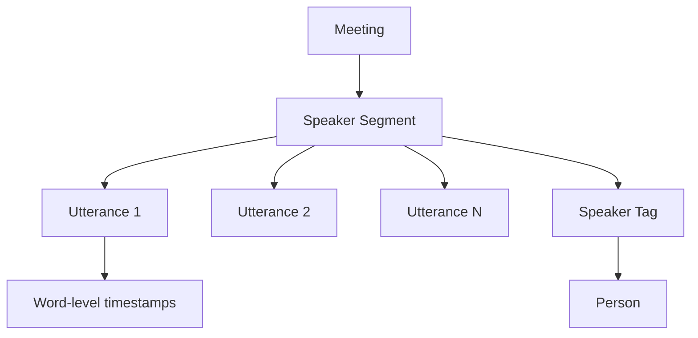

OpenCouncil automatically transcribes council meeting videos into searchable text with advanced speaker recognition capabilities. The system processes YouTube videos, identifies speakers using voice biometrics, and creates timestamped transcripts with utterance-level precision.

## How it works

The transcription system uses a multi-stage pipeline to process meeting videos:

<Steps>
  <Step title="Video submission">
    Provide a YouTube URL for the council meeting video. The system validates that the meeting exists and checks for existing transcripts.
  </Step>
  
  <Step title="Voice preparation">
    The system collects voiceprints from known council members and builds a custom vocabulary with city names, person names, and party names to improve accuracy.
  </Step>
  
  <Step title="Task processing">
    A background task downloads the video, extracts audio, and sends it to the transcription service with custom prompts and vocabulary.
  </Step>
  
  <Step title="Speaker identification">
    The system matches anonymous speaker segments to known council members using voice biometric matching with confidence scores.
  </Step>
  
  <Step title="Data storage">
    Speaker segments and utterances are stored in the database with timestamps, creating a fully searchable transcript linked to specific people.
  </Step>
</Steps>

## Speaker recognition

OpenCouncil uses voice biometrics to automatically identify speakers in meeting recordings:

<AccordionGroup>
  <Accordion title="Voiceprint matching">
    The system compares speaker audio segments against stored voiceprints for each council member. When a match is found with sufficient confidence, the speaker is automatically tagged with the person's identity.
    
    ```typescript
    const voiceprints: Voiceprint[] = people
      .filter(person => person.voicePrints && person.voicePrints.length > 0)
      .map(person => ({
        personId: person.id,
        voiceprint: person.voicePrints![0].embedding
      }));
    ```
  </Accordion>
  
  <Accordion title="Administrative body filtering">
    Only voiceprints for people relevant to the meeting's administrative body are used for matching. This improves accuracy by limiting the search space to expected speakers.
    
    The system retrieves people based on the meeting's `administrativeBodyId` from `src/lib/tasks/transcribe.ts:92`.
  </Accordion>
  
  <Accordion title="Unknown speakers">
    When a speaker cannot be identified, they are labeled as "Unknown Speaker 1", "Unknown Speaker 2", etc. These can be manually corrected later through the UI.
  </Accordion>
</AccordionGroup>

## Custom vocabulary and prompts

To improve transcription accuracy for Greek council meetings, the system uses:

<CardGroup cols={2}>
  <Card title="Custom vocabulary" icon="book">
    A list of city-specific terms including:
    - Municipality name
    - Council member names
    - Political party names
    - Local place names
  </Card>
  
  <Card title="Custom prompts" icon="message">
    Context-aware instructions in Greek that describe the meeting:
    
    "Αυτή είναι η απομαγνητοφώνηση της συνεδρίασης του δήμου της [City] που έγινε στις [Date]."
  </Card>
</CardGroup>

## Data structure

Transcripts are organized hierarchically:



<Note>
  Each **speaker segment** represents continuous speech by one person. Segments are split when the speaker changes or when there's more than 5 seconds of silence.
</Note>

### Speaker segments

Speaker segments group consecutive utterances from the same speaker:

```typescript
if (currentSpeaker !== utterance.speaker ||
    (currentSegment && utterance.start - currentSegment.endTimestamp! > 5)) {
  // Start a new segment
  speakerSegments.push(currentSegment as SpeakerSegment);
  currentSegment = {
    startTimestamp: utterance.start,
    endTimestamp: utterance.end,
    speakerTagId: utterance.speaker.toString()
  };
}
```

From `src/lib/tasks/transcribe.ts:318-350`

### Utterances

Each utterance represents a complete sentence or phrase with:

- `startTimestamp` - Start time in seconds
- `endTimestamp` - End time in seconds  
- `text` - The transcribed text
- `drift` - Audio sync correction value

## Configuration

Set up transcription in your `.env` file:

<CodeGroup>
```bash .env
# Task API for background processing
TASK_API_URL=http://localhost:3005
TASK_API_KEY=your_task_api_key

# Optional: Custom transcription settings
CUSTOM_VOCABULARY=true
VOICE_RECOGNITION=true
```

```typescript Configuration example
// Request transcription for a meeting
await requestTranscribe(
  youtubeUrl,
  councilMeetingId,
  cityId,
  { force: false } // Set to true to re-transcribe
);
```
</CodeGroup>

## Performance optimization

The system uses several optimizations for large meetings:

<Tabs>
  <Tab title="Batch processing">
    Speaker segments are created in parallel batches of 50 to reduce database round-trips:
    
    ```typescript
    const BATCH_SIZE = 50;
    for (let i = 0; i < speakerSegmentsData.length; i += BATCH_SIZE) {
      const batch = speakerSegmentsData.slice(i, i + BATCH_SIZE);
      await Promise.all(batch.map(async (segment) => {
        // Create segment with nested utterances
      }));
    }
    ```
    
    This provides 10-50x performance improvement over sequential processing.
  </Tab>
  
  <Tab title="Pre-computation">
    Speaker segments and utterance mappings are computed before the database transaction to minimize transaction time:
    
    ```typescript
    // Pre-compute outside transaction
    const speakerSegmentsData = getSpeakerSegmentsFromUtterances(utterances);
    const segmentUtteranceMap = new Map();
    
    // Then execute transaction
    await prisma.$transaction(async (tx) => {
      // Use pre-computed data
    });
    ```
  </Tab>
  
  <Tab title="Nested creates">
    Utterances are created together with their parent segment in a single database operation using nested `createMany`:
    
    ```typescript
    await tx.speakerSegment.create({
      data: {
        // ... segment data
        utterances: {
          createMany: {
            data: segmentUtterances.map(u => ({ /* utterance data */ }))
          }
        }
      }
    });
    ```
  </Tab>
</Tabs>

## Reprocessing transcripts

You can force reprocessing of existing transcripts:

<Warning>
  Reprocessing with `force: true` will **delete all existing speaker data** including manually corrected speaker identifications. Use with caution.
</Warning>

```typescript
await requestTranscribe(
  youtubeUrl,
  councilMeetingId,
  cityId,
  { force: true }
);
```

When `force: false` (default), the system will throw an error if speaker segments already exist.

## API reference

Key functions from `src/lib/tasks/transcribe.ts`:

<ParamField path="requestTranscribe" type="function">
  Initiates transcription for a meeting video
  
  <Expandable title="Parameters">
    - `youtubeUrl`: string - URL of the YouTube video
    - `councilMeetingId`: string - ID of the council meeting
    - `cityId`: string - ID of the city
    - `options.force`: boolean - Whether to delete existing transcript and reprocess
  </Expandable>
</ParamField>

<ParamField path="handleTranscribeResult" type="function">
  Processes the transcription result from the task server
  
  <Expandable title="Parameters">
    - `taskId`: string - ID of the transcription task
    - `response`: TranscribeResult - Result containing transcript and speaker data
    - `options.force`: boolean - Whether to overwrite existing segments
  </Expandable>
</ParamField>

## Next steps

<CardGroup cols={2}>
  <Card title="Search transcripts" icon="magnifying-glass" href="/features/search">
    Learn how to search across all meeting transcripts
  </Card>
  
  <Card title="AI summaries" icon="sparkles" href="/features/ai-summaries">
    Generate summaries and insights from transcripts
  </Card>
  
  <Card title="Meeting highlights" icon="video" href="/features/meeting-highlights">
    Create shareable video clips from transcripts
  </Card>
  
  <Card title="Notifications" icon="bell" href="/features/notifications">
    Set up alerts for transcript availability
  </Card>
</CardGroup>