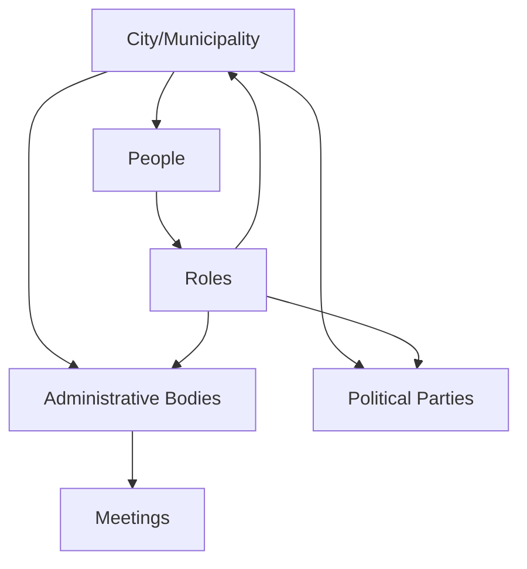

## Overview

OpenCouncil models the complex organizational structure of municipal governance in Greece and other regions. The system distinguishes between cities (municipalities/regions), administrative bodies (councils, committees, communities), political parties, and individual people with specific roles.

## Organizational hierarchy

Municipal governance follows a clear hierarchical structure:



## Cities

A `City` represents a municipality or region—the top-level governance entity.

### City types

<Tabs>
  <Tab title="Municipality" badge="Default">
    **Type**: `municipality`
    
    **Example**: Municipality of Athens (Δήμος Αθηναίων)
    
    **Characteristics**:
    - Local city government
    - Municipal council and committees
    - Direct services to residents
  </Tab>
  
  <Tab title="Region">
    **Type**: `region`
    
    **Example**: Region of Attica (Περιφέρεια Αττικής)
    
    **Characteristics**:
    - Regional government
    - Broader geographic scope
    - Coordination between municipalities
  </Tab>
</Tabs>

### City configuration

```prisma prisma/schema.prisma
model City {
  id        String   @id @default(cuid())
  name      String   // Αθήνα
  name_en   String   // Athens
  name_municipality String // Δήμος Αθηναίων
  name_municipality_en String // Municipality of Athens
  
  authorityType AuthorityType @default(municipality)
  status CityStatus @default(pending)
  officialSupport Boolean @default(false)
  
  // Geographic data
  geometry Unsupported("geometry")?
  timezone String
  
  // Feature flags
  supportsNotifications Boolean @default(false)
  consultationsEnabled Boolean @default(false)
  
  // External integrations
  wikipediaId String?
  diavgeiaUid String? // For Diavgeia decision polling
}
```

### City status

<Steps>
  <Step title="Pending">
    City has been created but not yet approved for public listing
  </Step>
  
  <Step title="Unlisted">
    City is active but not shown in public city lists (accessible by direct link)
  </Step>
  
  <Step title="Listed">
    City is publicly visible and appears in city selection interfaces
  </Step>
</Steps>

## Administrative bodies

Administrative bodies represent the various councils, committees, and communities within a city.

### Body types

<CardGroup cols={3}>
  <Card title="Council" icon="users-rectangle">
    **Greek**: Συμβούλιο
    
    **Example**: Δημοτικό Συμβούλιο (Municipal Council)
    
    Primary legislative body
  </Card>
  
  <Card title="Committee" icon="clipboard-list">
    **Greek**: Επιτροπή
    
    **Example**: Δημοτική Επιτροπή (Municipal Committee)
    
    Specialized working groups
  </Card>
  
  <Card title="Community" icon="building">
    **Greek**: Κοινότητα
    
    **Example**: 5η Δημοτική Κοινότητα (5th Municipal Community)
    
    Geographic subdivisions
  </Card>
</CardGroup>

### Administrative body model

```prisma prisma/schema.prisma
model AdministrativeBody {
  id        String   @id @default(cuid())
  name      String   // 5η Δημοτική Κοινότητα
  name_en   String   // 5th Municipal Community
  type      AdministrativeBodyType
  
  // Notification behavior
  notificationBehavior NotificationBehavior @default(NOTIFICATIONS_APPROVAL)
  
  // External integrations
  youtubeChannelUrl String?
  contactEmails String[] @default([])
  diavgeiaUnitIds String[] @default([])
  
  city      City     @relation(fields: [cityId], references: [id], onDelete: Cascade)
  cityId    String
  meetings  CouncilMeeting[]
}
```

### Notification behavior

Each administrative body controls how notifications are handled:

<Tabs>
  <Tab title="Approval required" badge="Default">
    **Setting**: `NOTIFICATIONS_APPROVAL`
    
    **Behavior**: Notifications created but require admin approval before sending
    
    **Use case**: New bodies or those wanting review control
  </Tab>
  
  <Tab title="Automatic">
    **Setting**: `NOTIFICATIONS_AUTO`
    
    **Behavior**: Notifications automatically sent immediately upon creation
    
    **Use case**: Established bodies with trusted notification processes
  </Tab>
  
  <Tab title="Disabled">
    **Setting**: `NOTIFICATIONS_DISABLED`
    
    **Behavior**: No notifications created for this body's meetings
    
    **Use case**: Bodies that don't want citizen notifications
  </Tab>
</Tabs>

## Political parties

Parties represent political organizations within a city.

```prisma prisma/schema.prisma
model Party {
  id        String   @id @default(cuid())
  name      String   // ΣΥΡΙΖΑ-ΠΣ
  name_en   String   // SYRIZA-PS
  name_short String  // ΣΥΡΙΖΑ
  name_short_en String // SYRIZA
  colorHex  String   // #CC0000
  logo      String?
  
  city City @relation(fields: [cityId], references: [id], onDelete: Cascade)
  cityId String
  
  roles Role[]
}
```

<Note>
  Parties are city-specific—the same political organization in different cities has separate `Party` records.
</Note>

### Party display

Parties are visually distinguished by:
- **Color**: Hex color code for badges and UI elements
- **Logo**: Optional party logo image
- **Short name**: Abbreviated form for space-constrained displays

## People and roles

People (council members, mayors, etc.) are connected to organizational entities through the `Role` model.

### Person model

```prisma prisma/schema.prisma
model Person {
  id        String   @id @default(cuid())
  name      String   // Κώστας Μπακογιάννης
  name_en   String   // Kostas Bakoyannis
  name_short String
  name_short_en String
  image     String?
  profileUrl String?
  
  activeFrom DateTime?
  activeTo DateTime?
  
  city   City   @relation(fields: [cityId], references: [id], onDelete: Cascade)
  cityId String
  
  roles Role[]
}
```

### Role model

The `Role` model provides flexible role assignments:

```prisma prisma/schema.prisma
model Role {
  id        String   @id @default(cuid())
  
  personId String
  person Person @relation(fields: [personId], references: [id], onDelete: Cascade)
  
  // Optional scopes (only one should be set for each role)
  cityId String?
  city City? @relation(fields: [cityId], references: [id], onDelete: Cascade)
  
  partyId String?
  party Party? @relation(fields: [partyId], references: [id], onDelete: Cascade)
  
  administrativeBodyId String?
  administrativeBody AdministrativeBody? @relation(fields: [administrativeBodyId], references: [id], onDelete: Cascade)
  
  // Role metadata
  isHead Boolean @default(false)
  name String?    // Δήμαρχος
  name_en String? // Mayor
  rank Int?
  
  startDate DateTime?
  endDate DateTime?
  
  @@unique([personId, cityId, partyId, administrativeBodyId])
}
```

### Role patterns

OpenCouncil supports two valid patterns for storing roles (see `/guides/roles-reference` for details):

<Tabs>
  <Tab title="Pattern A: Explicit city" badge="Recommended">
    All roles include `cityId` for explicit context:
    
    - **City role**: `{cityId, partyId: null, administrativeBodyId: null}`
    - **Party role**: `{cityId, partyId, administrativeBodyId: null}`
    - **Body role**: `{cityId, partyId: null, administrativeBodyId}`
    
    **Advantages**: Simpler queries, consistent pattern
  </Tab>
  
  <Tab title="Pattern B: Implicit city">
    Only city-level roles have `cityId`; others derive it:
    
    - **City role**: `{cityId, partyId: null, administrativeBodyId: null}`
    - **Party role**: `{cityId: null, partyId, administrativeBodyId: null}`
    - **Body role**: `{cityId: null, partyId: null, administrativeBodyId}`
    
    **Advantages**: More normalized, clear semantic distinction
  </Tab>
</Tabs>

### Example role combinations

A single person could have multiple simultaneous roles:

<Steps>
  <Step title="City role">
    Deputy Mayor of Athens
    
    `{cityId: "athens", name: "Αντιδήμαρχος", isHead: false}`
  </Step>
  
  <Step title="Party role">
    Member of Party A
    
    `{cityId: "athens", partyId: "partyA"}`
  </Step>
  
  <Step title="Administrative body role">
    Chair of Finance Committee
    
    `{cityId: "athens", administrativeBodyId: "finance", name: "Πρόεδρος", isHead: true}`
  </Step>
</Steps>

<Warning>
  A person cannot have multiple roles within the same context (e.g., cannot be both Chair and Vice Chair of the same committee).
</Warning>

## Meetings and bodies

Council meetings are linked to administrative bodies:

```prisma prisma/schema.prisma
model CouncilMeeting {
  id        String   @default(cuid())
  name      String
  name_en   String
  dateTime  DateTime
  
  city   City   @relation(fields: [cityId], references: [id], onDelete: Cascade)
  cityId String
  
  administrativeBody AdministrativeBody? @relation(fields: [administrativeBodyId], references: [id], onDelete: SetNull)
  administrativeBodyId String?
  
  @@id([cityId, id])
}
```

<Note>
  Administrative body is optional—some meetings may not be associated with a specific body.
</Note>

## External integrations

### Diavgeia integration

Diavgeia is Greece's government transparency portal. Cities and bodies can configure integration:

<Accordion title="City-level">
  **Field**: `diavgeiaUid`
  
  **Purpose**: Organization identifier for decision polling
  
  **Example**: `99222206` for Municipality of Athens
</Accordion>

<Accordion title="Body-level">
  **Field**: `diavgeiaUnitIds`
  
  **Purpose**: Array of unit IDs for more precise matching
  
  **Example**: `["81689"]` for specific committee
</Accordion>

### YouTube integration

**Field**: `youtubeChannelUrl`

**Purpose**: Link to administrative body's YouTube channel for meeting videos

### Email integration

**Field**: `contactEmails`

**Purpose**: Array of emails to receive meeting transcripts and notifications

## Geographic data

Cities store geographic boundaries using PostGIS:

```sql
geometry geometry(GEOMETRY, 4326)
```

This enables:
- Map visualization of city boundaries
- Proximity calculations for notifications
- Geographic search and filtering

## People ordering

Cities can configure how people are displayed:

<Tabs>
  <Tab title="Default ordering">
    **Setting**: `peopleOrdering: default`
    
    **Behavior**: Alphabetical by name
  </Tab>
  
  <Tab title="Party rank ordering">
    **Setting**: `peopleOrdering: partyRank`
    
    **Behavior**: Ordered by party affiliation and rank within party
    
    **Use case**: Display majority/opposition structure
  </Tab>
</Tabs>

## Creating administrative structures

### Import script example

OpenCouncil includes import scripts for bulk creation:

```typescript scripts/insert_athens_communities.ts
// Example: Creating a municipal community
await prisma.administrativeBody.create({
  data: {
    name: "5η Δημοτική Κοινότητα",
    name_en: "5th Municipal Community",
    type: "community",
    notificationBehavior: "NOTIFICATIONS_APPROVAL",
    cityId: city.id
  }
});
```

### Manual creation via admin UI

Administrators can create structures through the admin interface at `/admin` (requires super admin rights).

## Best practices

<AccordionGroup>
  <Accordion title="Use explicit city scope (Pattern A)">
    When creating roles, always include `cityId` for consistency and simpler queries.
  </Accordion>
  
  <Accordion title="Configure notification behavior carefully">
    Start with `NOTIFICATIONS_APPROVAL` for new bodies until the notification process is tested.
  </Accordion>
  
  <Accordion title="Maintain bilingual naming">
    Always provide both Greek and English names for international accessibility.
  </Accordion>
  
  <Accordion title="Link Diavgeia IDs">
    Configure Diavgeia integration to enable automatic decision fetching.
  </Accordion>
</AccordionGroup>

## File reference

<Card title="Key implementation files">
  - `prisma/schema.prisma` - Data models (City: lines 16-57, AdministrativeBody: lines 92-111, Party: lines 113-134, Person: lines 136-163, Role: lines 760-793)
  - `scripts/insert_athens_communities.ts` - Import script example
  - `src/lib/db/cities.ts` - City query functions
  - `docs/roles.prd.md` - Role system documentation
</Card>