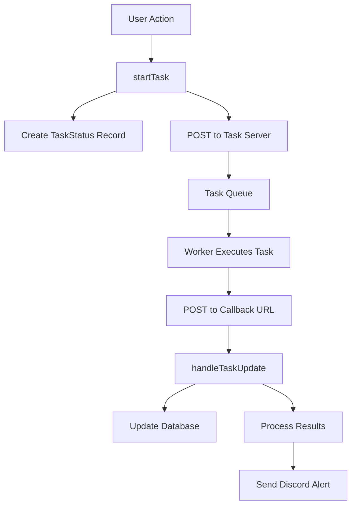

## Overview

OpenCouncil's task workflow system offloads resource-intensive operations—such as media transcription, AI-powered summarization, and speaker analysis—from the main Next.js application to a dedicated backend task server. This architecture ensures the web application remains responsive while complex tasks execute efficiently in the background.

## Architecture components

The task system consists of three primary components working in concert:

<CardGroup cols={3}>
  <Card title="Next.js application" icon="browser">
    User-facing web application that initiates tasks and receives status updates
  </Card>
  <Card title="Task server" icon="server">
    Node.js backend server responsible for executing long-running tasks
  </Card>
  <Card title="PostgreSQL database" icon="database">
    Stores task status, request payloads, and results for persistence and reprocessing
  </Card>
</CardGroup>

### System flow



## Task lifecycle

Every task progresses through a standardized lifecycle from initiation to completion.

<Steps>
  <Step title="Initiation">
    A user action or cron job triggers `startTask()`, which creates a `TaskStatus` record with status `pending` and sends a POST request to the task server with a callback URL.
  </Step>
  
  <Step title="Execution">
    The task server adds the task to its queue. A worker picks up the task and begins execution, optionally sending progress updates back to the callback URL with status `processing`.
  </Step>
  
  <Step title="Completion">
    Upon completion, the worker sends a final update:
    - **Success**: Status `success` with result data
    - **Error**: Status `error` with error message
  </Step>
  
  <Step title="Update handling">
    The Next.js callback endpoint receives the update, calls `handleTaskUpdate()` to update the database, and invokes a task-specific result handler if successful.
  </Step>
</Steps>

## Core task types

OpenCouncil supports multiple task types organized by their role in the processing pipeline.

<Accordion title="Pipeline tasks (required)">
  These tasks are essential for meeting processing and enforce idempotency:
  
  - **transcribe**: Convert audio/video to text with speaker identification
  - **fixTranscript**: AI-powered transcript correction and refinement
  - **humanReview**: Manual review and approval checkpoint
  - **transcriptSent**: Email transcript to administrative body
  - **summarize**: Generate AI summaries for meeting segments and subjects
</Accordion>

<Accordion title="Optional tasks">
  These tasks can run multiple times and don't enforce idempotency:
  
  - **processAgenda**: Extract meeting subjects from agenda documents
  - **generatePodcastSpec**: Create podcast episode specifications
  - **generateHighlight**: Generate video highlights from segments
  - **splitMediaFile**: Split media into smaller chunks
  - **generateVoiceprint**: Create voice embeddings for speaker identification
  - **pollDecisions**: Fetch decisions from Diavgeia transparency portal
</Accordion>

## Task handler registry

The system uses a centralized registry pattern to maintain clean, scalable code:

```typescript src/lib/tasks/registry.ts
export type TaskResultHandler = (
  taskId: string, 
  result: any, 
  options?: { force?: boolean }
) => Promise<void>;

export const taskHandlers: Record<string, TaskResultHandler> = {
  transcribe: handleTranscribeResult,
  summarize: handleSummarizeResult,
  generatePodcastSpec: handleGeneratePodcastSpecResult,
  // ... other handlers
};
```

All handlers follow a consistent signature, making the system predictable and maintainable.

## Task reprocessing

A powerful feature of the architecture is the ability to reprocess task results without re-running the expensive backend operation.

<Note>
  **How it works**: The complete `responseBody` from the task server is stored in the `TaskStatus` table, enabling reprocessing from saved data.
</Note>

### Basic reprocessing

The `processTaskResponse` function uses the handler registry to reprocess stored results:

```typescript src/lib/tasks/tasks.ts
export const processTaskResponse = async (
  taskType: string, 
  taskId: string, 
  options?: { force?: boolean }
) => {
  const task = await prisma.taskStatus.findUnique({ where: { id: taskId } });
  if (!task) throw new Error(`Task ${taskId} not found`);

  const handler = taskHandlers[taskType];
  if (!handler) throw new Error(`Unsupported task type: ${taskType}`);

  await handler(taskId, JSON.parse(task.responseBody!), options);
}
```

### Force mode for data cleanup

<Tabs>
  <Tab title="Transcribe tasks">
    When reprocessing with `force: true`, the system:
    
    1. Deletes all `SpeakerTag` records (cascades to `SpeakerSegment` and `Utterance`)
    2. Recreates everything from stored response
    
    This prevents duplicate data and ensures a clean slate.
  </Tab>
  
  <Tab title="Other tasks">
    Most tasks use `upsert` operations, so they can safely reprocess without the `force` flag. They simply update existing records or create new ones as needed.
  </Tab>
</Tabs>

### UI integration

The `TaskStatus` component provides a user-friendly reprocessing interface:

- **All tasks**: Dialog with explanation, loading states, and feedback messages
- **Transcribe tasks**: Two action buttons
  - "Reprocess Only" - Attempts without cleanup (may create duplicates)
  - "Delete & Reprocess" - Cleans up first (recommended)
- **Other tasks**: Single "Reprocess from Database" button (safe with upsert)

## Automated task initiation

Some tasks run automatically on a schedule via cron-triggered API routes.

<Accordion title="Diavgeia decision polling">
  The `pollDecisions` task automatically fetches decisions from Greece's transparency portal:
  
  **Endpoint**: `GET /api/cron/poll-decisions`
  
  **Authentication**: `Authorization: Bearer <CRON_SECRET>`
  
  **Progressive backoff schedule**:
  
  | Days since first poll | Minimum interval |
  |-----------------------|------------------|
  | 0–7 (week 1)         | Every cron run   |
  | 7–14 (week 2)        | 2 days           |
  | 14–21 (week 3)       | 3 days           |
  | 21+ (week 4+)        | 7 days           |
  | 90+                   | Stops            |
  
  With 2x/day cron: ~14 polls week 1, ~3-4 week 2, ~2-3 week 3, then ~1/week
</Accordion>

### Setup example

```bash
# Generate secret
openssl rand -base64 32

# Add to crontab (poll every 12 hours)
0 0,12 * * * curl -H "Authorization: Bearer $CRON_SECRET" \
  https://your-domain.com/api/cron/poll-decisions
```

## Error handling

The system implements comprehensive error handling:

<CardGroup cols={2}>
  <Card title="Initial failures" icon="xmark">
    If the initial fetch to the task server fails, the task status is immediately set to `failed`
  </Card>
  <Card title="Backend failures" icon="triangle-exclamation">
    If the task fails during execution, the server reports `error` status back to the callback
  </Card>
  <Card title="Processing failures" icon="bug">
    Result processing errors are caught, logged, and trigger Discord alerts to admins
  </Card>
  <Card title="No auto-retry" icon="rotate-right">
    Failed tasks require manual reprocessing via the TaskStatus UI
  </Card>
</CardGroup>

## Adding a new task

The registry pattern makes adding tasks straightforward:

<Steps>
  <Step title="Add to configuration">
    ```typescript src/lib/tasks/types.ts
    export const TASK_CONFIG = {
      // ... existing tasks
      myNewTask: {
        requiredForPipeline: false, // or true
      },
    } as const;
    ```
  </Step>
  
  <Step title="Define types">
    ```typescript src/lib/apiTypes.ts
    export interface MyNewTaskRequest extends TaskRequest {
      myParam: string;
    }
    
    export interface MyNewTaskResult {
      outputData: string;
    }
    ```
  </Step>
  
  <Step title="Create handler">
    ```typescript src/lib/tasks/myNewTask.ts
    export const handleMyNewTaskResult = async (
      taskId: string, 
      result: MyNewTaskResult,
      options?: { force?: boolean }
    ) => {
      const task = await prisma.taskStatus.findUnique({ 
        where: { id: taskId } 
      });
      
      // Process results with upsert for idempotency
      await prisma.myEntity.upsert({
        where: { /* unique identifier */ },
        update: { /* fields */ },
        create: { /* fields */ }
      });
    };
    ```
  </Step>
  
  <Step title="Register handler">
    ```typescript src/lib/tasks/registry.ts
    import { handleMyNewTaskResult } from './myNewTask';
    
    export const taskHandlers: Record<string, TaskResultHandler> = {
      // ... existing handlers
      myNewTask: handleMyNewTaskResult,
    };
    ```
  </Step>
  
  <Step title="Implement backend">
    On the `opencouncil-tasks` server:
    - Create endpoint (e.g., `/my-new-task`)
    - Accept `MyNewTaskRequest` payload
    - Send status updates to `callbackUrl`
  </Step>
  
  <Step title="Update frontend">
    ```typescript
    import { startTask } from '@/lib/tasks/tasks';
    
    const requestBody: MyNewTaskRequest = { myParam: 'value' };
    await startTask('myNewTask', requestBody, meetingId, cityId);
    ```
  </Step>
</Steps>

## Key principles

<AccordionGroup>
  <Accordion title="Idempotency">
    Use `upsert` operations when possible so tasks can be safely reprocessed without side effects.
  </Accordion>
  
  <Accordion title="Force mode">
    If your task creates data that can't be upserted, implement cleanup logic when `options?.force` is true.
  </Accordion>
  
  <Accordion title="Error handling">
    Let errors bubble up—the system handles logging and status updates automatically.
  </Accordion>
  
  <Accordion title="Transactions">
    Use Prisma transactions for operations that create multiple related records to ensure data consistency.
  </Accordion>
  
  <Accordion title="Consistent signatures">
    Always follow the `TaskResultHandler` signature for compatibility with the registry system.
  </Accordion>
</AccordionGroup>

## File reference

<Card title="Key implementation files">
  - `src/lib/tasks/tasks.ts` - Core task orchestration logic
  - `src/lib/tasks/types.ts` - Task configuration and type definitions
  - `src/lib/tasks/registry.ts` - Task handler registry
  - `src/lib/apiTypes.ts` - Request/response type definitions
  - `src/app/api/cities/[cityId]/meetings/[meetingId]/taskStatuses/[taskStatusId]/route.ts` - Callback endpoint
  - `src/components/meetings/admin/TaskStatus.tsx` - UI component for task management
</Card>